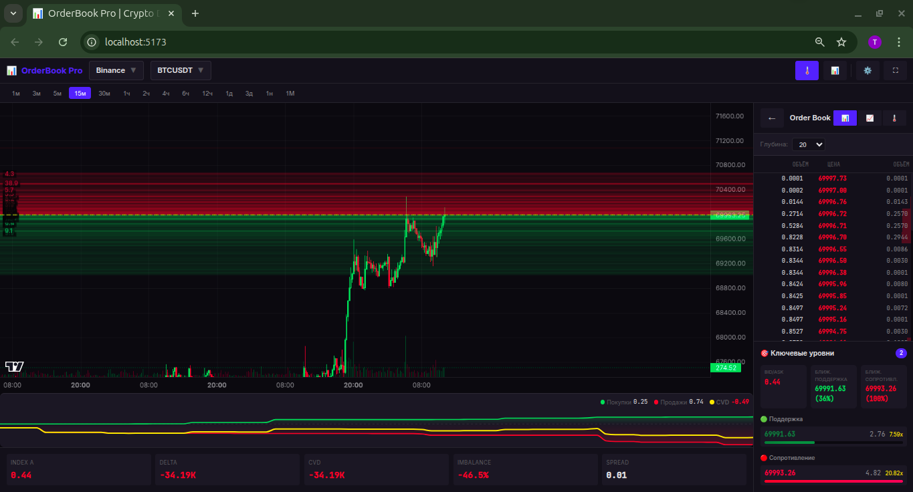
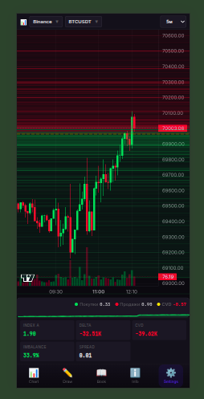

# 📊 Quant Order Book

[](https://developer.mozilla.org/en-US/docs/Web/JavaScript)
[](https://vitejs.dev/)
[](https://tradingview.github.io/lightweight-charts/)
[](https://opensource.org/licenses/MIT)

A **professional-grade** cryptocurrency order book visualization platform with real-time heatmaps, advanced analytics, and mobile-first design. Built for traders who need **institutional-level tools** in a clean, responsive interface.

[🇷🇺 Русская версия](README_RU.md) | [🇬🇧 English](README.md)

---

## 🎯 Why OrderBook Pro?

Traditional order book tools either:
- Require expensive subscriptions (TradingView Premium, Bookmap)
- Lack real-time heatmap visualization
- Have poor mobile experience
- Don't show cumulative volume delta (CVD)

**Quant Order Book solves these problems** by providing:

✅ **Real-Time Heatmap** — 5000 order book levels visualized on chart  
✅ **Multi-Exchange** — Binance, OKX, Bybit support  
✅ **Quant Metrics** — Index α, Delta, CVD, Imbalance, Spread  
✅ **Mobile-First** — TradingView-like experience on phone  
✅ **Zero Cost** — Free, open-source, no subscriptions  

---

## 🖼️ Screenshots

| Desktop | Mobile |
|---------|--------|
|  |  |
| CVD Chart | Compact Metrics |

---

## 🚀 Quick Start

### Prerequisites

- Node.js 18+ 
- npm or yarn

### Installation

```bash
# Clone repository
git clone https://github.com/nssanta/quant-order-book.git
cd quant-order-book

# Install dependencies
npm install

# Start dev server
npm run dev
```

Open **http://localhost:5173** in your browser.

### Production Build

```bash
npm run build
npm run preview
```

---

## 📖 Features

### 🌡️ Order Book Heatmap

Real-time visualization of order book depth overlaid on candlestick chart:

- **Green zones** = Bid orders (buyers)
- **Red zones** = Ask orders (sellers)  
- **Brightness** = Volume intensity
- **5000 levels** loaded from Binance REST API

### 📊 Advanced Analytics

| Metric | Description |
|--------|-------------|
| **Index α** | Buyer vs seller strength ratio. >1 = buyers stronger |
| **Delta** | Buy volume minus sell volume |
| **CVD** | Cumulative Volume Delta over time |
| **Imbalance** | Order book bid/ask imbalance percentage |
| **Spread** | Best ask - best bid price |

### 📱 Mobile Experience

- **Bottom Navigation** — 5 tabs: Chart, Draw, Book, Info, Settings
- **Compact Header** — Exchange, Symbol, Timeframe in one row
- **Touch-Optimized** — Swipe, pinch-zoom, responsive layout

### 🏦 Multi-Exchange Support

| Exchange | Status | Features |
|----------|--------|----------|
| Binance | ✅ Full | Klines, Order Book, Trades |
| OKX | ✅ Full | Klines, Order Book |
| Bybit | ✅ Full | Klines, Order Book |
| Coinbase | ⚠️ Basic | Klines only |

---

## 🏗️ Project Structure

```
orderbook-pro/
├── index.html              # Entry point
├── src/
│   ├── main.js             # App initialization
│   ├── charts/
│   │   ├── CandlestickChart.js    # Lightweight Charts wrapper
│   │   ├── OrderBookHeatmap.js    # Canvas-based heatmap
│   │   ├── CVDChart.js            # D3.js CVD visualization
│   │   ├── DepthChart.js          # Order book depth
│   │   └── DOMLadder.js           # DOM ladder view
│   ├── components/
│   │   ├── SettingsPanel.js       # User preferences
│   │   └── LevelsSummary.js       # Key price levels
│   ├── exchanges/
│   │   ├── BinanceAdapter.js      # Binance WebSocket
│   │   ├── OKXAdapter.js          # OKX WebSocket
│   │   ├── BybitAdapter.js        # Bybit WebSocket
│   │   └── CoinbaseAdapter.js     # Coinbase WebSocket
│   ├── analytics/
│   │   ├── IndexAlpha.js          # Quant metrics
│   │   └── LevelAnalyzer.js       # Level detection
│   ├── core/
│   │   ├── WebSocketManager.js    # Multi-WS manager
│   │   └── StorageManager.js      # LocalStorage
│   └── styles/
│       └── main.css               # TradingView-like theme
```

---

## ⚙️ Configuration

Settings panel allows customization:

| Setting | Options | Default |
|---------|---------|---------|
| Candle Up Color | Any HEX | `#00c853` |
| Candle Down Color | Any HEX | `#ff1744` |
| Heatmap Opacity | 0.1 - 1.0 | `0.7` |
| Heatmap Levels | 50-500 | `100` |
| Order Book Depth | 5-100 | `20` |

Color presets: Classic, TradingView, Binance, Monochrome

---

## 🔧 Technical Details

### Key Technologies

- **Lightweight Charts** v4 — High-performance financial charts
- **D3.js** — CVD chart visualization  
- **Canvas 2D** — Order book heatmap rendering
- **WebSocket** — Real-time data streaming
- **Vite** — Fast dev server and bundler

### Performance

- 60 FPS heatmap rendering
- Efficient WebSocket message handling
- Debounced re-renders on settings change
- Canvas-based drawing for minimal DOM overhead

---

## 📄 License

MIT License — free for personal and commercial use.
